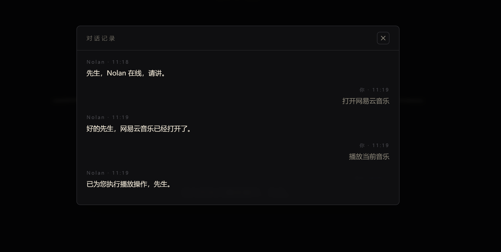

# Nolan

**Local-first Chinese voice AI butler for Windows — 会听、会说、会动手、会主动、还能被打断的本地 AI 管家。**

> Nolan is a local-first, Chinese-speaking voice butler for Windows. It listens with faster-whisper (1.5× real-time on CPU), thinks with a GLM-5.2 agent loop driving 14 tools (including arbitrary sandboxed shell commands), sees your screen and automates the GUI, remembers you long-term, fires conditional triggers ("if it rains tomorrow, remind me to take an umbrella"), and talks back with a GLM-TTS male voice that **you can interrupt mid-sentence — just start talking** (full-duplex barge-in, no AEC needed). Everything runs on your own machine — your API key, memory, and files never leave the repo folder.

> 🇨🇳 以下为中文详细版。

---

## 🎯 使命

> **Nolan 是数字时代每个人应有的伙伴。**
>
> 它不像其它 AI 一样只关注用户依不依赖它，而是真正站在用户的角度解决问题——
> **用户不用，坚决不打扰；要用时，绝对出手。**

第一性原理推导：一个人用电脑干活的底层成本只有三个——意图翻译成本、执行等待成本、**信任验证成本**。大厂 AI 只砍了第一个的一半（告诉你怎么做，但不动手）。Nolan 砍掉第二个（它动手、自己做、进度可见），并最终把第三个降到零：

> **成为一个人「不检查就敢用」的数字同伴。贾维斯的本质不是聪明，是托尼从不怀疑他。**

**裁决标准**（写在所有路线图之前）：每个功能提案只问一句——*它让「敢托付」的范围扩大了一寸吗？* 功能 × 信任 = 用户敢托付的事。信任是 0，功能再多都是 demo；信任随时间复利。

---


*⬆️ 真机演示（无剪辑加速）：对 Nolan 说「打开网易云音乐，播放我喜欢列表里的第一首歌」，它自己调起软件、操作界面、开始播放。*



---

## 📊 用数字说话（全部可复现的实测基准）

| 能力 | 基准 | 成绩 |
|---|---|---|
| 单步任务 | `benchmark_p0.py` 300 题水库（10 类目） | ✅ 首轮全绿 |
| 大目标分层规划 | `benchmark_p1.py` 10 题（LLM 拆步→逐步执行→汇总） | ✅ 20% → **100%** |
| 技能固化与泛化 | `benchmark_p2.py` 8 题（一次学习，同类任务模板化重放） | ✅ **8/8** |
| 全链路回归 | `selftest_gaokao.py` 57 题（动手+动嘴+记忆+提醒+技能） | ✅ **57/57**（每次提交必跑） |
| ASR 延迟 | `bench_asr.py` 4 段标准语料（small/beam1，CPU int8） | ✅ **1.53× 实时**（换代前 medium 为 5.49×，提速 3.6 倍，准确率 92% 持平） |
| 全双工打断 | `test_barge_in.py` / `test_bargein_echo.py` | ✅ 13/13（短促杂音不误触、回声双保险） |

---

## ⚡ 10 分钟快速开始（Windows）

1. **克隆仓库**：`git clone https://github.com/xcq20100224/Nolan.git`
2. **一键安装**：双击运行根目录的 `install.bat`（自动建虚拟环境、装全部 Python 与前端依赖；需要提前装好 [Python 3.10+](https://www.python.org/downloads/) 和 [Node.js LTS](https://nodejs.org)）
3. **填 API Key**：用记事本打开 `jarvis/llm_config.json`，把 `api_key` 改成你的智谱 API Key（[open.bigmodel.cn](https://open.bigmodel.cn) 免费申请）
4. **启动**：双击 `Nolan-Web.bat`（或在 `nolan-web` 目录执行 `npm run dev`）
5. **使用**：浏览器打开 http://localhost:7100 （推荐 Chrome / Edge，语音需要麦克风权限）

### 🎤 语音用法

点一下界面上的 **🎤 麦克风按钮**（或按 **Alt 键**）开始说话，说完**再点一次 🎤**（或再按一次 Alt）停止录音，Nolan 会自动识别、思考并语音回复你。

**全双工打断（P3）**：开启右上角「唤醒词」开关后——
- 对麦克风说「**诺兰**」即可免点击唤醒；
- **Nolan 播报时直接开口说话即可打断它**，它会立刻闭嘴、听懂你的新指令并执行。无需 AEC：自适应能量门（播报声成为基线）+ 回声文本过滤（它知道自己正在说什么）双保险。

---

## Nolan 是什么

Nolan 是一个**本地优先的 Windows 中文语音 AI 管家**：对着麦克风说中文，它不仅能听懂、会回答，还能真的动手——执行 shell 命令、操作应用程序、控制媒体播放、看屏幕、记事情、定闹钟、**按条件主动行动**。它不是云端 SaaS，你的记忆、文件和 API Key 全部留在自己电脑上。

## ✨ 特性

- 🎙️ **语音对话**：faster-whisper 本地中文识别（CPU 上 1.53× 实时）+ 自然语音播报，全程免键盘
- ⏸️ **全双工打断**：播报中直接开口即可打断，无 AEC 双保险设计（CLI 与网页版同构）
- 🧠 **长期记忆**：记住你的偏好与事实，跨会话回忆（`jarvis/memory/` 本地存储）
- ⏰ **主动提醒与闹钟**：「1 分钟后叫醒我」「明天提醒我开会」——到点主动弹出并播报
- 🎯 **条件触发（P4）**：「如果明天下雨就提醒我带伞」「每当有重大 AI 新闻就告诉我」「每隔 30 分钟提醒我喝水」——联网核实条件，成立即行动；执行型动作直接动手，不只嘴上提醒
- 🤖 **Agent 多步工具循环**：GLM-5.2 驱动，一次请求可连续调用多个工具直至任务完成
- 🪜 **分层规划（P1）**：大目标自动拆步、逐步执行、历史传递、汇总汇报
- 📚 **技能固化（P2）**：做过的任务固化为参数化模板，同类任务一次学习终身重放
- 🛠️ **14 个工具**：含沙盒化**任意 shell 命令**、文件读写、通用应用打开、系统信息等
- 👁️ **屏幕感知与 GUI 自动化**：截屏 + GLM-4.5V 视觉理解 + pyautogui 键鼠操作
- 🎵 **媒体控制**：播放 / 暂停 / 切歌 / 音量调节（Windows 媒体键）
- 🖥️ **网页版 NEGA 风界面**：React + Vite 构建的复古未来风驾驶舱（`nolan-web/`）
- 🗣️ **GLM-TTS 男声**：低沉男声播报，edge-tts 离线兜底
- 🛡️ **三级安全闸**：危险命令分级拦截（自动放行 → 确认执行 → 硬性拒绝）

## 🏗️ 架构

```
        你（中文语音）
            │
            ▼
      ┌───────────┐     ┌────────────────────────────────┐
      │  耳朵 ears │ ──▶ │            大脑 brain           │
      │ whisper   │     │   GLM-5.2 Agent 多步工具循环     │
      └───────────┘     └───┬───────────┬───────────┬────┘
                            ▼           ▼           ▼
                      ┌──────────┐ ┌────────┐ ┌──────────┐
                      │ 手 hands │ │眼 eyes │ │记忆+提醒 │
                      │ 14 个工具 │ │截屏+GUI│ │ memory   │
                      │ 含 shell │ │ 自动化  │ │ reminders│
                      └──────────┘ └────────┘ └──────────┘
                            │
                            ▼
                      ┌───────────┐
                      │  嘴巴 mouth│ ──▶ GLM-TTS 男声播报
                      └───────────┘        （edge-tts 离线兜底）
```

## 🚀 Quickstart

### 1. 安装依赖

```bash
# Python 依赖（建议 Python 3.10+，虚拟环境；install.bat 已自动完成）
pip install -r requirements.txt

# 网页版前端依赖
cd nolan-web
npm install
```

### 2. 配置智谱 API Key

```bash
# 复制示例配置并填入你自己的智谱 API Key（https://open.bigmodel.cn）
# install.bat 已自动完成复制，此处为手动方式
copy jarvis\llm_config.json.example jarvis\llm_config.json
# 编辑 llm_config.json，把 api_key 改成你的真实 Key
```

> `llm_config.json` 已在 `.gitignore` 中，不会被提交。

### 3. 启动

**网页版（推荐）**

```bash
cd nolan-web
npm run dev        # 同时拉起 Python 后端 (7101) 与 Vite 前端
# 打开终端打印的地址（Chrome/Edge，语音输入需要麦克风权限）
```

**桌面版（tkinter GUI）**

```bash
python jarvis/nolan_app.py    # 或直接双击 Nolan.bat
```

**命令行语音模式**

```bash
python jarvis/jarvis.py       # 或双击 Nolan-CLI.bat
```

> 💡 三个 `.bat` 启动器会优先使用 PATH 中的 Python（`where python`），找不到再回退到内置托管运行时；也可用 `NOLAN_PYTHON` 环境变量覆盖 `nolan-web/scripts/dev.mjs` 的解释器选择。

## 🎬 演示

> 📹 **[Nolan 自录自配演示视频（45 秒）](docs/nolan-demo.mp4)** —— Nolan 自己录屏、自己配音：打开网易云音乐播放「我喜欢的音乐」第一首，再随手打开记事本。旁白为 Nolan 本人的 GLM-TTS 男声。

## ⚖️ 商用与 API 条款提醒

Nolan 依赖[智谱开放平台](https://open.bigmodel.cn)的 GLM 系列模型（GLM-5.2 / GLM-4.5V / GLM-TTS）。**智谱 API 的免费额度仅限个人非商用体验**；将 Nolan 或其能力用于商业用途前，请务必阅读并遵守智谱开放平台的[服务条款与商用授权政策](https://open.bigmodel.cn)，自行取得相应授权。本项目作者不承担因违反第三方 API 条款产生的任何责任。

## 📄 License

[MIT License](LICENSE) © 2026 xcq20100224

---

### Repo layout

```
Nolan/
├── jarvis/          # Python 后端：ears / brain / hands / eyes / memory / mouth
│   │                  + triggers（条件触发）+ skills（技能固化）+ reminders
│   ├── llm_config.json.example   # 配置模板（install.bat 会自动复制为 llm_config.json）
│   ├── selftest_gaokao.py        # 57 题全链路回归（动手+动嘴，每次提交必跑）
│   ├── benchmark_p0/p1/p2.py     # 300 题单步水库 / 分层规划 / 技能泛化基准
│   ├── bench_asr.py              # ASR 模型换代基准（延迟×准确率实测）
│   └── test_jarvis.py            # 免麦克风全链路自动测试
├── nolan-web/       # React + Vite 网页版（NEGA 风驾驶舱）+ Python 标准库后端
├── docs/            # 演示 GIF / 自录自配演示视频 / 界面截图
├── Nolan.bat        # 桌面 GUI 启动器
├── Nolan-CLI.bat    # 命令行语音模式启动器
└── Nolan-Web.bat    # 网页版一键启动器
```
